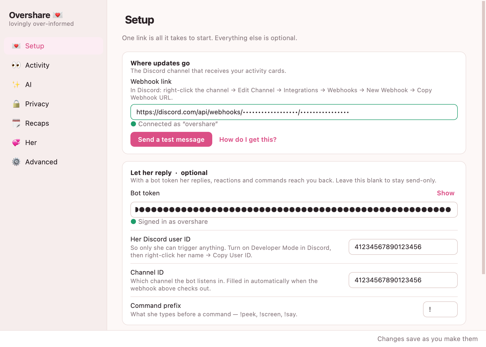
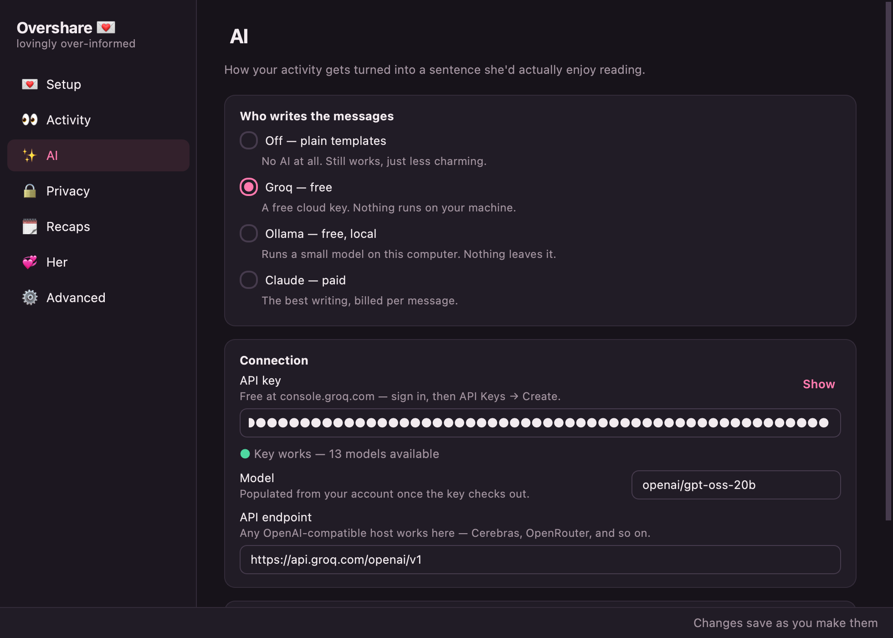
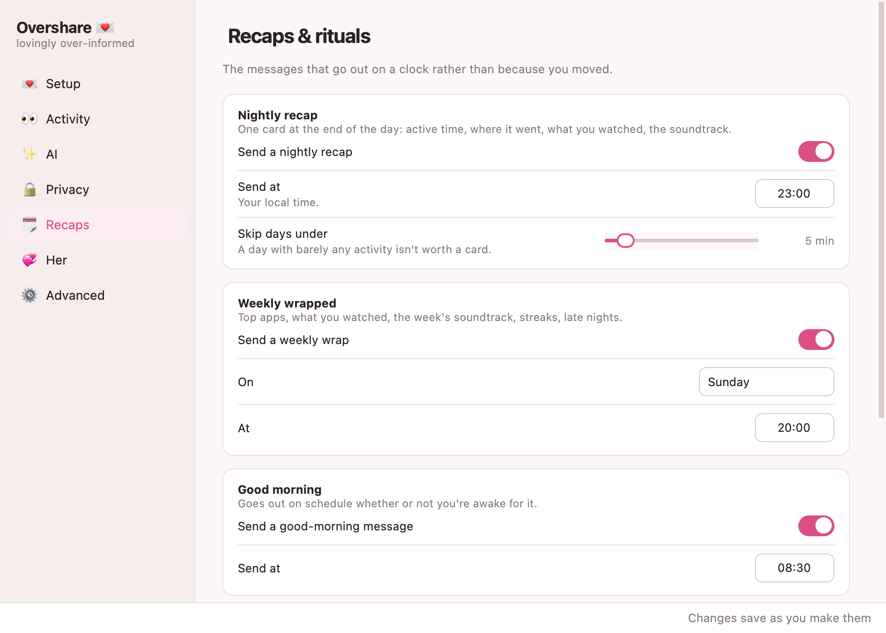
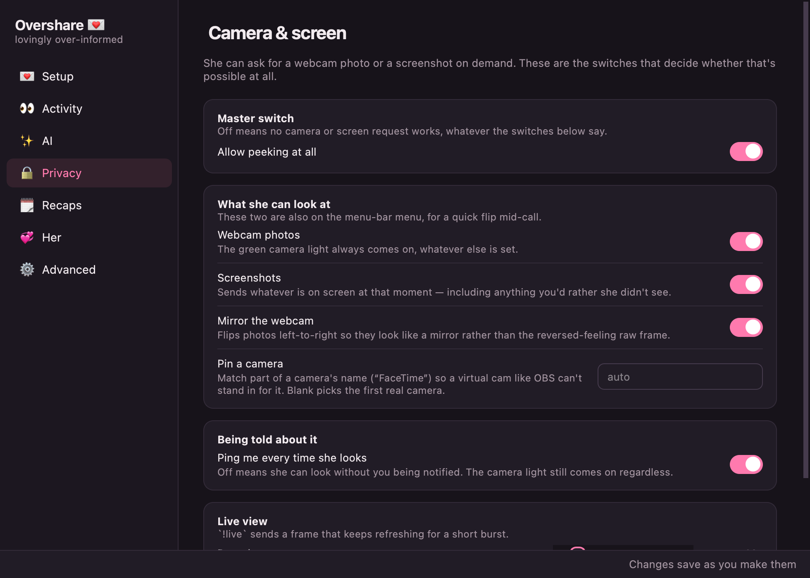
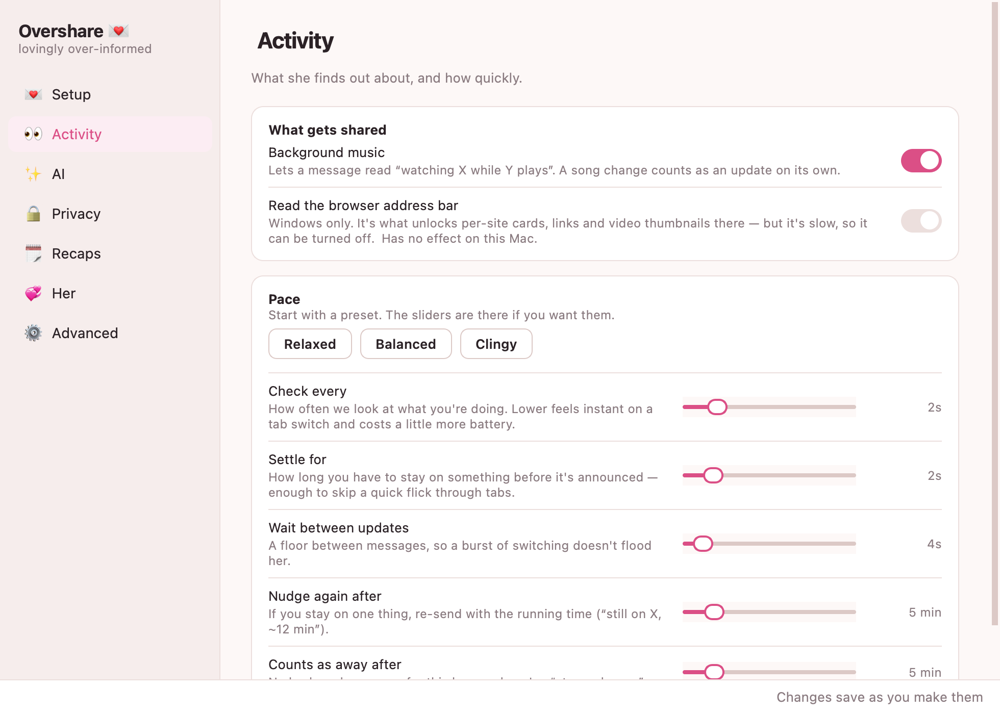

# overshare 💌

**the clingy-girlfriend starter pack 💅** — a tiny menu-bar / tray app that keeps
your partner *lovingly over-informed* about everything you do on your computer,
automatically, in real time, in detail. For the girlfriends who need to know
where their man is at all times, and the boyfriends who have *nothing to hide* 😇

<p align="center">
  <a href="https://github.com/iota-x/overshare/releases/latest">
    </a>
  <a href="https://github.com/iota-x/overshare/releases/latest">
    </a>
</p>

<p align="center">
  <a href="https://github.com/iota-x/overshare/releases/latest">
    </a>
  
  
</p>

<p align="center">
  
</p>

> **Origin story:** my girlfriend said I don't give her enough *detail* about my
> day. So instead of just... texting more like a normal person, I built an app
> that broadcasts my entire screen life to her. This is that app. 💛

**No terminal, no Python, no config files.** Download, drag, paste one Discord
link into a real settings window, done.

Works on **macOS** and **Windows**. Whenever you switch apps or tabs (and every
few minutes as a heartbeat), it posts a warm, AI-written one-liner + a rich card
to a Discord channel (or her DMs):

- **VS Code / terminal** → `coding in Cursor — app.py 💻`
- **YouTube / Twitch / Netflix** → the video/stream (+ thumbnail & "▶️ watch along" on macOS)
- **Spotify** (even in the background) → the track (+ "🎧 play along" link on macOS)
- **Discord** → which channel you're in
- **Games / any app** → caught by the generic layer
- **Idle** → "stepped away 🙂"; late night → "goodnight 🌙"

## What it does

- **Sees everything** — frontmost app, window/file titles, browser tab, background
  music, idle time.
- **Per-site smarts** — 📺 YouTube, 🟣 Twitch, 👽 Reddit, 🐙 GitHub, 🤖 ChatGPT… own
  emoji + brand color + phrasing.
- **Rich Discord cards** — links, thumbnails, channel names, now-playing, duration.
- **Peek on demand** — she can ask for a 📸 webcam photo, a 🖥️ screenshot, or a
  live-ish auto-refreshing frame — and you get pinged every time (see [Peek](#peek--camera--screen-on-demand)).
- **Free AI** — [Groq](https://console.groq.com) (free cloud) / Ollama (free local)
  / Claude, or plain templates.
- **Two-way** — with a Discord bot she can reply, react, and run commands.
- **Recaps** — a daily summary + a weekly "Wrapped" (top apps, watches, soundtrack,
  streaks, late nights).
- **Sweet touches** — listen/watch-along, morning/night bookends, "all yours now",
  mood/status, tone presets she picks.
- **Featherweight & resilient** — tiny footprint, auto-reconnects, ⚠️ if anything breaks.
- **An off-switch** — one click to Pause. Because *sometimes* you want privacy. (Or not. 😏)
- **A real settings app** — every dial in one window, with the connection checks
  built in. Nothing to edit by hand.

---

## The settings window

Seven pages, and it checks its own work: paste a webhook and it verifies the link
before you leave the field, pulls the channel ID out of it so you never go hunting
in Discord's developer mode, and lists the AI models your key can actually reach
instead of guessing. Changes save as you make them, and the running app picks
them up within a couple of seconds — no restart, no relaunch.

<table>
  <tr>
    <td width="50%"></td>
    <td width="50%"></td>
  </tr>
  <tr>
    <td><b>AI</b> — pick a brain, key checked live, models listed from your account</td>
    <td><b>Recaps</b> — nightly, weekly and the morning/night bookends</td>
  </tr>
  <tr>
    <td></td>
    <td></td>
  </tr>
  <tr>
    <td><b>Privacy</b> — one master switch over camera and screen, and what she's told</td>
    <td><b>Activity</b> — presets first, sliders if you want them</td>
  </tr>
</table>

It follows your system light/dark setting automatically.

---

## Install

Grab the installer for your machine from
**[Releases](https://github.com/iota-x/overshare/releases/latest)** — there's
nothing to install first, no Python, no terminal. Each release carries both:

| Platform | File | What it does |
|---|---|---|
| **macOS** 11+ (Apple Silicon & Intel) | `Overshare-x.y.z.dmg` | Opens a window — drag Overshare onto Applications. |
| **Windows** 10/11 (64-bit) | `Overshare-Setup-x.y.z.exe` | A normal installer. Per-user, so no admin prompt, and it can add itself to startup for you. |

Both are self-contained: the Python runtime and every dependency are inside, so
they run on a machine that has never had Python on it. That does make them large
for what they are — the macOS `.dmg` is about 107 MB, most of it Qt.

**The first launch needs one extra step**, because the app isn't signed by a
paid developer account:

* **macOS** says *"Apple could not verify Overshare is free of malware"* and
  offers only Move to Trash. Instead: open Applications, **right-click
  Overshare → Open**, then click **Open** in the dialog. Once only.
* **Windows** shows a blue SmartScreen panel. Click **More info → Run anyway**.

Then a 💌 appears in your menu bar (macOS) or system tray (Windows). Click it →
**Settings…** and paste a Discord webhook link. That's the whole setup — the
window checks the link as you type and tells you if it worked.

### Permissions

**macOS** asks for these as you go (System Settings → Privacy & Security):

* **Accessibility** — window and file titles, and which Discord channel you're in
* **Automation** — your browser's tab and what's playing in Spotify
* **Camera** / **Screen Recording** — only if you use `!peek` / `!screen` / `!live`

After granting Accessibility, quit Overshare from the menu bar and reopen it.

**Windows** needs none of this, with one exception: if `!peek` comes back empty,
turn on **Settings → Privacy & security → Camera → Let desktop apps access your
camera**.

### Start it with your computer

* **macOS** — System Settings → General → Login Items → **+** → Overshare
* **Windows** — tick *"Start Overshare when I sign in"* during install, or drop a
  shortcut in the folder that `Win+R` → `shell:startup` opens

---

## Running from source

You only need this to hack on it — the installers above are self-contained.

```bash
git clone https://github.com/iota-x/overshare.git
cd overshare
./run.sh          # macOS — makes a venv, installs deps, creates .env
run.bat           # Windows — same
```

Settings still live in the GUI; open it directly with:

```bash
python run_app.py --settings
```

Configuration is layered: the settings window writes `config.json` in your data
folder, and anything it hasn't set falls back to `.env`, then to built-in
defaults. An existing `.env` therefore keeps working untouched, and you can mix
the two freely.

Your data folder is:

* **macOS** — `~/Library/Application Support/Overshare/`
* **Windows** — `%APPDATA%\Overshare\`
* **from source** — the repo's own `data/` folder

### Building the installers

PyInstaller can't cross-compile, so each installer has to be built on its own OS.
That's what CI is for — you never need a Windows machine.

### Cutting a release

```bash
git tag v1.0.0
git push origin v1.0.0
```

That's it. [`.github/workflows/release.yml`](.github/workflows/release.yml) then:

1. builds `Overshare.app` on a macOS runner and wraps it into a `.dmg`;
2. builds `Overshare.exe` on a Windows runner and wraps it with Inno Setup;
3. publishes a GitHub release with **both** files attached and install notes.

The version comes from the tag (`v1.0.0` → `1.0.0`), so nothing needs bumping by
hand. Running the workflow manually (**Actions → Build installers → Run
workflow**) builds both as downloadable artifacts without publishing a release —
useful for testing a build before you tag one.

### Building by hand

```bash
pip install pyinstaller
pyinstaller packaging/Overshare.spec --noconfirm   # both platforms

./packaging/make_dmg.sh 1.0.0        # macOS   -> dist/Overshare-1.0.0.dmg
iscc packaging\installer.iss         # Windows -> dist/Overshare-Setup-1.0.0.exe
```

One spec covers both platforms. The Windows installer needs
[Inno Setup](https://jrsoftware.org/isinfo.php) (`winget install JRSoftware.InnoSetup`).

### Signing

Both installers ship **unsigned**, which is exactly what causes the first-launch
warnings above. The workflow already contains the codesign + notarization steps;
they're skipped while the secrets are absent, and switch on by themselves once
these exist — no code change:

| Secret | For |
|---|---|
| `APPLE_ID` | the Apple ID that owns the developer account |
| `APPLE_TEAM_ID` | your 10-character Team ID |
| `APPLE_APP_PASSWORD` | an app-specific password for notarization |
| `APPLE_CERT_P12` | your Developer ID certificate, base64-encoded |
| `APPLE_CERT_PASSWORD` | the password for that `.p12` |

Apple's side needs a $99/yr developer account. Windows code-signing needs a
separate OV/EV certificate (~$200–400/yr), and OV certificates still trip
SmartScreen until they build reputation — so for a project like this, telling
people to click *"More info → Run anyway"* is the honest trade.

> **Windows notes:** it reads the active window title (which for browsers already
> includes the page title, e.g. *"FIFA - YouTube"*) and reads background Spotify
> from its window title. Windows has no cross-browser URL API, so the active
> tab's URL is read from the address bar via UI Automation (`uiautomation`,
> installed automatically) — that's what gives Windows clickable links, YouTube
> thumbnails and per-site brand colors. It's cached per tab change; turn it off
> under Activity → *Read the browser address bar*. Even off, sites are still
> recognised from the tab title, so brand names and colors keep working.
> Everything else has full Windows parity: `!peek`/`!screen`/`!live` (webcam via
> `opencv-python-headless`, screen via Pillow's `ImageGrab`), the daily
> auto-selfie, `!say` (PowerShell TTS), `!sound`, `!kiss`/`!hug`/`!boop`,
> `!remind`, `!petname`, permission requests, the daily couple question, the
> love-o-meter, and the settings window all work the same as on macOS.
---

## AI providers

Pick one on the **AI** page of the settings window — it verifies the key and lists
the models your account can actually reach. The `.env` names are given here too,
for configuring it by hand:

| Provider | Cost | Setup |
|---|---|---|
| **`groq`** ⭐ | free | free key at [console.groq.com](https://console.groq.com) → `GROQ_API_KEY=gsk_...`. Cloud, fast, no card, nothing runs on your machine. Defaults to `openai/gpt-oss-20b`. |
| **`ollama`** | free | `brew install ollama && ollama pull llama3.2` (macOS) → `AI_PROVIDER=ollama`. Local, ~2 GB RAM. |
| **`anthropic`** | paid | key at [console.anthropic.com](https://console.anthropic.com) → `ANTHROPIC_API_KEY=sk-ant-...`. Best writing. |
| *(none)* | free | `AI_ENABLED=false` — plain templates. |

> Groq retires models periodically. If updates suddenly go plain and templated,
> that's the tell — the old model 404s and it silently falls back. Run
> `python -m in_detail.selftest` to see it, and set `GROQ_MODEL` to a current
> model from [console.groq.com/docs/models](https://console.groq.com/docs/models).
> Reasoning models are handled (the thinking is hidden, not sent to her).

---

## Checking it works

```bash
python -m in_detail.selftest          # render one card of every kind, send nothing
python -m in_detail.selftest --live   # a card for what you're doing right now
python -m in_detail.selftest --post   # actually send them to her channel
```

Dry run by default. It leads with a health check — platform, AI provider and
model, webhook, Accessibility, and whether the day's tally is saving — then
prints every card shape, so formatting problems show up on demand instead of
whenever the activity happens to occur.

---

## Two-way bot (optional) 💌

Lets her reply, react, and run commands — you get it all as notifications.

1. [discord.com/developers](https://discord.com/developers/applications) → **New
   Application** → **Bot** → **Reset Token** → copy it.
2. Enable **MESSAGE CONTENT INTENT** on the Bot page → Save.
3. **OAuth2 → URL Generator** → scopes `bot`; permissions: View Channels, Read
   Message History, Add Reactions, Attach Files → open the URL → add to your server.
4. Paste the token into **Settings… → Setup → Bot token**. It turns green when
   Discord accepts it, and the channel ID fills itself in from your webhook.
   Add **her Discord user ID** there too, so only she can trigger anything.

No restart needed — the running app picks it up within a couple of seconds.

### Commands she types

The prefix defaults to `!` and is **changeable** — she can run `!prefix >` to switch
to any symbol, or you can set it under **Settings… → Setup → Command prefix**.

| Command | Does |
|---|---|
| `!help` | posts the full command list |
| `!wyd` | bot replies with your live activity |
| `!song` · `!recap` | now-playing · today's recap |
| `!peek` · `!screen` | a webcam photo · a screenshot |
| `!live` · `!live screen` | live-ish view (auto-refreshing frame) |
| `!poke` `!miss` `!callme` `!break` `!food` | pings you |
| `!gm` / `!gn` · say **i love you** | greetings · auto ❤️ react |
| `!dm` / `!channel` / `!both` | where her updates go |
| `!tone cutesy` / `chill` / `detailed` | how you write to her |
| `!prefix <x>` | change the command prefix |
| react ❤️ to any card | 💛 flashes your tray/menu bar |

### Peek — camera & screen on demand

`!peek` sends a **webcam photo**, `!screen` a **screenshot**, and `!live` an
auto-refreshing frame that feels live (add `screen` for the desktop). A bot can't
open a real live *stream*, so this is fast snapshot-on-demand.

- **Webcam** needs `brew install imagesnap`. The screen uses the built-in
  `screencapture` — no install. (The app finds `imagesnap` even when launched as a
  bundled `.app` with a minimal `PATH`.)
- First use, macOS asks for **Camera** and **Screen Recording** permission for the app (System Settings → Privacy). The green camera light shows whenever the webcam fires.
- Only allowed users (`HER_USER_IDS`) can trigger it, and **you get a card + flash every time she peeks** (`PEEK_NOTIFY=false` to silence, `PEEK_ENABLED=false` to disable the whole feature).
- **Per-source toggles in the menu bar** — **Allow camera peeks** and **Allow screen peeks** flip camera and screen independently, live (checkmark = allowed). Turn the camera off and `!peek` politely bounces while `!screen` still works — no restart, and it sticks across launches.

---

## Config reference

Everything below has a control in the settings window — you never have to touch a
file. The names are listed because they're still valid `.env` keys (and the keys
written into `config.json`), which matters if you'd rather configure by hand.

| Key | What |
|---|---|
| `DISCORD_WEBHOOK_URL` | **required** — where cards are posted |
| `AI_PROVIDER` / `AI_ENABLED` | `groq` / `ollama` / `anthropic`; `false` = templates |
| `GROQ_API_KEY`, `OLLAMA_MODEL`, `ANTHROPIC_API_KEY` | provider keys/models |
| `DISCORD_BOT_TOKEN`, `BOT_PREFIX` | two-way bot + command prefix |
| `DISCORD_CHANNEL_ID`, `DISCORD_HOME_CHANNEL_ID`, `HER_USER_ID`, `HER_NAME` | bot scoping |
| `PEEK_ENABLED`, `PEEK_NOTIFY`, `LIVE_SECONDS`, `LIVE_INTERVAL` | camera/screen peek |
| `POLL_INTERVAL`, `STABILIZE`, `MIN_GAP`, `HEARTBEAT`, `IDLE_THRESHOLD` | timing (s) |
| `REPORT_MEDIA`, `RECAP_TIME`, `WEEKLY_DAY/TIME`, `GM_TIME`, `START_PAUSED` | features |
| `GROQ_MODEL` | Groq model id (default `openai/gpt-oss-20b`) |
| `READ_BROWSER_URL` | Windows: read the tab URL from the address bar (default on) |

Every key has an inline comment in `.env.example`.

## Troubleshooting

Most connection problems answer themselves in **Settings…** — the Setup and AI
pages re-check as you open them and say what's actually wrong.

| Symptom | Fix |
|---|---|
| macOS: *"Apple could not verify this app"* on first open | Right-click the app → **Open** → **Open**. Expected: it isn't signed. Once only. |
| Windows: SmartScreen blocks the installer | **More info → Run anyway**. Same reason. |
| Nothing arrives at all | Settings… → Setup → check the dot under the webhook, then **Send a test message** |
| macOS: only app names (no file/tab detail) | Grant **Accessibility**, then Quit + reopen |
| macOS: no browser URL / background Spotify | Grant **Automation** (browser + Spotify) |
| `!peek` says "no camera tool set up" | `brew install imagesnap`, then Quit + reopen the app |
| `!peek` says "couldn't grab that" | Grant **Camera** (and **Screen Recording** for `!screen`) to the app, then retry |
| ⚠️ indicator | Bot disconnected or webhook failing — check token/webhook/internet |
| Her DM updates don't arrive | Her Discord DMs must be open to the bot |
| Bot shows offline | Check token, Message Content Intent, and that it's invited |
| Messages are plain/templated | AI provider/key not set, **or the model id is stale** — run `python -m in_detail.selftest` to see the real error |
| Cards show only the app name ("Discord") | Window title wasn't readable — grant Accessibility (macOS); `selftest` reports this |
| Daily/weekly recap looks too quiet | A day with no saved file isn't a quiet day — the card now flags "⚠️ not recorded". Check `~/Library/Logs/in-detail.log` |
| ⚠️ indicator with everything else fine | The day's tally isn't saving; the reason is in `~/Library/Logs/in-detail.log` |

## Stack

Python · [`rumps`](https://github.com/jaredks/rumps) (macOS menu bar) /
[`pystray`](https://github.com/moses-palmer/pystray) (Windows tray) ·
[`PySide6`](https://doc.qt.io/qtforpython-6/) for the settings window, in its own
process · `pyobjc` + `osascript` (macOS) / `pywin32` + `psutil` (Windows) ·
[`discord.py`](https://github.com/Rapptz/discord.py) for the bot ·
`imagesnap` + `screencapture` (macOS peeks). Pluggable AI:
Groq / Ollama / Anthropic / templates. Packaged with
[PyInstaller](https://pyinstaller.org) + `hdiutil` (`.dmg`) /
[Inno Setup](https://jrsoftware.org/isinfo.php) (`.exe`).

## Privacy

With Groq or Ollama your activity text stays private. Nothing is stored or sent
anywhere except the Discord channel you configure. The camera/screen peek is off
unless you enable it, limited to allowed users, and pings you every time. There's
a Pause button for the moments that shouldn't be a live feed.

---

## Potential improvements (intentionally *not* added 😅)

Real, useful features I skipped — because **I share everything with my girl. Like,
everything.** If you're more private, you'll want some of these:

- **🔒 Privacy blocklist / incognito guard** — the big one. Auto-hide banking,
  passwords, 1Password, and *private/incognito windows* behind a vague "busy 🔒".
  I left this out on purpose (she can see my banking, my passwords, my incognito
  tabs — no secrets here). **Most people should add this before going live.**
- **🌙 Quiet hours** — auto-pause overnight so it isn't broadcasting while you sleep.
- **😴 Snooze** — "pause 1 hour / till tomorrow" instead of only an indefinite pause.
- **🔗 Windows browser URLs** — thumbnails / clickable links / per-site colors on
  Windows (needs UI-Automation address-bar reading).
- **👥 Multiple recipients** · **📊 web dashboard**.

*(🎚️ A real settings window used to be on this list — it's built now, see
[The settings window](#the-settings-window).)*

PRs welcome. Or just trust your partner completely and skip half of these like I did. 💛

---

*Built with a lot of love (and slightly concerning transparency). MIT — do
whatever you want with it.*
